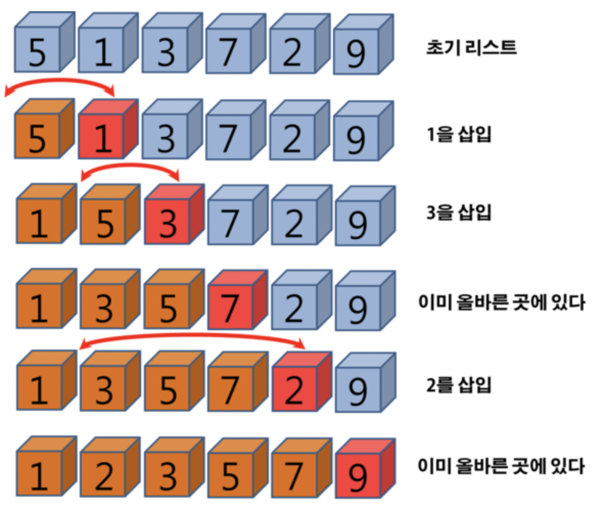

# 정렬 알고리즘
 알고리즘에서 정렬은, 말 그대로 어떤 데이터를 특정한 기준으로 정렬하는 것이다. 컴퓨터 사이언스에서 대표적인 정렬 알고리즘은 아래와 같다.
- 선택정렬
- 버블정렬
- 삽입정렬
- 병합정렬
- 퀵정렬


## 선택정렬 (Selection Sort)
 `선택정렬`은 주어진 자료들 중에서 첫 번째 자료를 두 번째 자료부터 마지막 자료까지 차례대로 비교하여, 오름차순 또는 내림차순으로 첫 번째 자료와 교환하는 방식으로 정렬을 진행한다. 한 번 순회할 때마다, 해당 자료의 가장 작은 또는 가장 큰 값이 순차적으로 앞에 위치하게 된다. 

`선택정렬 `알고리즘의 순서는 아래와 같다.
1. 주어진 배열 중에서 최솟값을 찾는다.
2. 그 값을 맨 앞에 위치한 값과 교체한다(패스(pass)).
3. 맨 처음 위치를 뺀 나머지 리스트를 같은 방법으로 교체한다.
4. 하나의 원소만 남을 때까지 위의 1~3 과정을 반복한다.

`선택정렬`은 구현하기 쉽고 자료 이동 횟수가 미리 결정되는 장점이 있으나, 자료 순서가 바뀔 수 있어 불안정하며 시간 복잡도는 O(n^2)로 최악이라는 단점을 갖는다. 

 `선택정렬` 기본 파이썬 코드는 아래와 같다.
 ```Python
def selection_sort(arr):
    for i in range(len(arr) - 1):
        min_idx = i
        for j in range(i + 1, len(arr)):
            if arr[j] < arr[min_idx]:
                min_idx = j
        arr[i], arr[min_idx] = arr[min_idx], arr[i]
 ```
 두 개의 반복문이 필요하다. 내부 반복문에서는 현재 index부터 마지막 index까지 최소값의 index를 찾아내고, 외부 반복문에서는 이 최소값의 index와 현재 index에 있는 값을 상호 교대(swap)한다. 외부 반복문에서는 index i를 0에서 n-2(또는 n-1. 마지막 index에서는 남는 값이 하나 밖에 없기 때문에 대세에 지장 없음)까지 진행시키며, 내부 반복문에서 이미 정렬된 값들에서는 관심이 없기 때문에 index j를 i에서 n-1까지 진행시킨다. 각 index에 대해서 최소값을 찾기 위해 대소 비교는 여러 번 일어나나 상호 교대(swap)은 딱 한번만 알어난다.


## 버블정렬 (Bubble Sort)
 `버블정렬`은 서로 인접한 두 원소를 비교하여 오름차순 또는 내림차순으로 정렬하는 방식이다. 한 번 순회할 때마다 아래와 같은 순서로 작동한다.
1. 0번째 원소와 1번째 원소를 비교 후 정렬
2. 1번째 원소와 2번째 원소를 비교 후 정렬…
3. n-1번째 원소와 n번째 원소를 비교 후 정렬

`버블 정렬`은 이미 정렬된 자료에 대해서 재정렬할 때는 O(n)을 갖는다. 그 외에는 O(n^2)의 최악의 알고리즘을 갖는다. 구현하기는 단순하지만, 매우 비효율적인 방식이다.

`버블정렬` 기본 파이썬 코드는 아래와 같다.
```python
def bubble_sort(arr):
    for i in range(len(arr) - 1, 0, -1):
        for j in range(i):
            if arr[j] > arr[j + 1]:
                arr[j], arr[j + 1] = arr[j + 1], arr[j]
```
내부 반복문에서는 첫번째 값부터 이전 패스에서 뒤로 보내놓은 값이 있는 위치 전까지 앞뒤 값을 계속해서 비교해나가면서, 앞의 값이 뒤의 값보다 클 경우에만 자리 교대(swap)를 한다. 외부 반복문에서는 뒤에서부터 앞으로 정렬 범위를 n-1부터 1까지 줄여나간다.

이전 패스에서 앞뒤 자리 비교(swap)이 한 번도 일어나지 않았다면, 정렬되지 않는 값이 하나도 없었다고 간주할 수 있다. 이 말은 이미 자료가 정렬이 되어있다고 확정할 수 있으므로, 따라서 이후 패스를 수행하지 않아도 된다. 이에 따라 위 코드를 최적화하면 아래처럼 수정할 수 있다.
``` python
def bubble_sort(arr):
    for i in range(len(arr) - 1, 0, -1):
        swapped = False
        for j in range(i):
            if arr[j] > arr[j + 1]:
                arr[j], arr[j + 1] = arr[j + 1], arr[j]
                swapped = True
        if not swapped:
            break
```

또한 이전 패스에서 앞뒤 자리 비교(swap)가 있었는지 여부를 체크하는 대신, 마지막으로 앞뒤 자리 비교가 있었던 index를 기억해두면 다음 패스에서는 그 자리 전까지만 정렬해도 된다. 이미 앞쪽이 다 정렬되어 있다는 것이 보장되기 때문이다. 따라서 한 칸씩 정렬 범위를 줄여나가는 대신, 한번에 여러 칸씩 정렬 범위를 줄여나갈 수 있다.
```python
def bubble_sort(arr):
    end = len(arr) - 1
    while end > 0:
        last_swap = 0
        for i in range(end):
            if arr[i] > arr[i + 1]:
                arr[i], arr[i + 1] = arr[i + 1], arr[i]
                last_swap = i
        end = last_swap
```


## 삽입정렬 (Insertion Sort)
`삽입정렬`은 자료 배열의 모든 요소를 앞에서부터 차례대로 이미 정렬된 배열 부분과 비교하여, 자신의 위치를 찾아 삽입함으로써 정렬을 완성하는 알고리즘이다. 삽입할 위치를 찾았다면, 그 위치에 자료를 삽입하기 위해 남은 자료들을 한 칸씩 뒤로 이동시켜 공간을 확보한다.



`삽입정렬`은 안정적이며 간단한 알고리즘이라는 장점이 있으나, 입력자료가 역순인 경우에는 시간복잡도가 O(n^2)으로 최악의 성능을 보여줄 수 있다는 단점이 있다. (이상적인 경우에는 O(n)으로, 선택정렬과 삽입정렬보다는 조금 나을지도.)

`삽입정렬` 기본 파이썬 코드는 아래와 같다.
```python
def insertion_sort(arr):
    for end in range(1, len(arr)):
        for i in range(end, 0, -1):
            if arr[i - 1] > arr[i]:
                arr[i - 1], arr[i] = arr[i], arr[i - 1]
```
두 개의 반복문이 필요하다. 내부 반복문에서는 정렬 범위에 새롭게 추가된 값과 기존 값들을 뒤에서부터 계속해서 비교해나가면서, 앞의 값이 뒤의 값보다 클 경우 자리 교대(swap)를 한다. 외부 반복문에서는 정렬 범위를 2에서 N으로 확대해 나간다.

이미 기존 데이터가 정렬이 되어있다는 것이 보장되는 경우, 아래처럼 최적화를 할 수 있다.
```python
def insertion_sort(arr):
    for end in range(1, len(arr)):
        i = end
        while i > 0 and arr[i - 1] > arr[i]:
            arr[i - 1], arr[i] = arr[i], arr[i - 1]
            i -= 1
```
기존에 있던 값들은 이전 패스에서 모두 정렬되었다는 점을 활용하면 불필요한 비교 작업을 제거할 수 있다. 예를 들면, [1, 2, 3, 5]에 4가 새롭게 추가된다면, 5는 4보다 크기 때문에 swap이 필요하지만, 3은 4보다 작기 때문에 swap이 필요없다. 그리고 3보다 앞에 있는 숫자들은 기존 패스에서 이미 정렬을 해놓았기 때문에, 더 이상의 대소 비교는 무의미하다. 따라서 이 사실을 이용하면 새롭게 추가된 값보다 작은 숫자를 만나는 최초의 순간까지만 내부 반복문을 수행해도 된다.

또한 위 최적화 코드에서, 굳이 일일이 swap하지 않고 단순 shift만 하다가 적절한 타이밍에 값을 추가하도록 함으로써 추가적인 최적화도 가능하다.
```python
def insertion_sort(arr):
    for end in range(1, len(arr)):
        to_insert = arr[end]
        i = end
        while i > 0 and arr[i - 1] > to_insert:
            arr[i] = arr[i - 1]
            i -= 1
        arr[i] = to_insert
```
swap 작업없이 단순히 값들을 shift 시키는 것만으로도 삽입 정렬의 구현이 가능하다. 앞의 값이 정렬 범위에 추가시킨 값보다 클 경우, 앞의 값을 뒤로 밀다가 최초로 작은 값을 만나는 순간에 그 뒤에 추가된 값을 꽃으면 된다.

## 병합정렬 (Merge Sort)
`병합정렬`은 하나의 리스트를 두 개의 균등한 크기로 분할하고 분할된 부분 리스트를 정렬한 다음, 두 개의 정렬된 부분 리스트를 합하여 전체가 정렬된 리스트가 되게 하는 방법이다. 


`병합정렬` 알고리즘은 안정적인 방법이며, 언제든 시간복잡도가 O(nlog_(n)) 이라는 장점을 갖는다. 특히 연속적인 데이터 덩어리인 배열이 아닌, `연결 리스트`로 레코드를 구성한다면 데이터 이동은 무시할 수 있을만큼 줄어들게 된다. 그러나, 배열로 구현한 경우에는 이동횟수가 늘어나기 때문에 매우 큰 시간적 낭비를 초래한다. (근데 파이썬의 리스트는 연결 리스트로 구현되어 있기 때문에 병합정렬을 구현하기 용이하다.)

`병합정렬`의 기본 파이썬 코드는 아래와 같다.
```python
def merge_sort(arr):
    if len(arr) < 2:
        return arr

    mid = len(arr) // 2
    low_arr = merge_sort(arr[:mid])
    high_arr = merge_sort(arr[mid:])

    merged_arr = []
    l = h = 0
    while l < len(low_arr) and h < len(high_arr):
        if low_arr[l] < high_arr[h]:
            merged_arr.append(low_arr[l])
            l += 1
        else:
            merged_arr.append(high_arr[h])
            h += 1
    merged_arr += low_arr[l:]
    merged_arr += high_arr[h:]
    return merged_arr
```
재귀를 이용하면 병합 정렬을 구현할 수 있다. 먼저 배열을 더 이상 나눌 수 없을 때까지 (즉, 원소가 하나만 남을 때까지) 최대한 분할한 후, 각 원소들을 다시 병합하면서 점점 큰 배열을 만들어 나간다. 이 재귀 알고리즘의 기저 조건은 입력 배열의 크기가 2보다 작을 때이며, 이 조건에 해당할 때는 배열을 그대로 반환하면 된다.

한편 병합 결과를 담을 새로운 배열을 매번 생성해서 리턴하지 않고, 인덱스 접근을 이용해 입력 배열을 계속해서 업데이트하면, 코드의 메모리 사용량을 대폭 줄일 수 있다. (In-place sort)
```python
def merge_sort(arr):
    def sort(low, high):
        if high - low < 2:
            return 
        mid = (low + high) // 2
        sort(low, mid)
        sort(mid, high)
        merge(low, mid, high)

    def merge(low, mid, high):
        temp = []
        l, h = low, mid

        while l < mid and h < high:
            if arr[l] < arr[h]:
                temp.append(arr[l])
                l += 1
            else:
                temp.append(arr[h])
                h += 1

        while l < mid:
            temp.append(arr[l])
            l += 1
        while h < high:
            temp.append(arr[h])
            h += 1

        for i in range(low, high):
            arr[i] = temp[i - low]

    return sort(0, len(arr))
```

## 퀵정렬 (Quick Sort)
`퀵정렬`은 하나의 리스트를 `피벗(pivot)`을 기준으로 두 개의 비균등한 크기로 분할하고 분할된 부분 리스트를 정렬한 다음, 두 개의 정렬된 부분 리스트를 합하여 전체가 정렬된 리스트가 되게 하는 방법이다.

1. 리스트 안에 있는 한 요소를 선택한다. 이렇게 고른 원소를 피벗(pivot) 이라고 한다.
2. 피벗을 기준으로 피벗보다 작은 요소들은 모두 피벗의 왼쪽으로 옮겨지고 피벗보다 큰 요소들은 모두 피벗의 오른쪽으로 옮겨진다. (피벗을 중심으로 왼쪽: 피벗보다 작은 요소들, 오른쪽: 피벗보다 큰 요소들)
3. 피벗을 제외한 왼쪽 리스트와 오른쪽 리스트를 다시 정렬한다.
    - 분할된 부분 리스트에 대하여 순환 호출 을 이용하여 정렬을 반복한다.
    - 부분 리스트에서도 다시 피벗을 정하고 피벗을 기준으로 2개의 부분 리스트로 나누는 과정을 반복한다.
4. 부분 리스트들이 더 이상 분할이 불가능할 때까지 반복한다. 리스트의 크기가 0이나 1이 될 때까지 반복한다.


`퀵정렬`은 말 그대로 빠르다. 시간 복잡도가 평균적으로 O(nlog_2(n)) 이며, 공간 복잡도도 O(logn)만큼만 필요하기 때문에 빠르고 슬림하다. 하지만, 이미 정렬된 리스트에 대해서는 정렬 시간이 비효율적으로 오래 걸리고, 최악의 pivot을 고른 경우 O(n^2)의 시간 복잡도를 가질 수 있으며, 로직 자체가 복잡하다는 단점이 있다. 

`퀵정렬`의 기본 파이썬 코드는 아래와 같다.
```python
def quick_sort(arr):
    if len(arr) <= 1:
        return arr
    pivot = arr[len(arr) // 2]
    lesser_arr, equal_arr, greater_arr = [], [], []
    for num in arr:
        if num < pivot:
            lesser_arr.append(num)
        elif num > pivot:
            greater_arr.append(num)
        else:
            equal_arr.append(num)
    return quick_sort(lesser_arr) + equal_arr + quick_sort(greater_arr)
```
먼저 리스트의 정 가운데 있는 값을 pivot 값으로 선택한다. 그 다음 pivot 값보다 작은 값, 동일한 값 그리고 큰 값을 담아둘 3개의 리스트를 생성한다. 이후 반복문을 통해 각 값을 pivot과 비교 후에 해당하는 리스트에 추가시킨다. 이 과정을 반복하기 위해 퀵 정렬 함수를 재귀적으로 호출한다. 마지막으로 재귀 호출의 결과를 다시 크기 순으로 합치면 정렬된 리스트를 얻을 수 있다.

위 방식은 간단하지만, 재귀로 인해 추가 메모리 사용이 과하여 메모리 손해가 크다. in-place 정렬을 활용한 최적화 코드는 아래와 같다. 
```python
def quick_sort(arr):
    def sort(low, high):
        if high <= low:
            return

        mid = partition(low, high)
        sort(low, mid - 1)
        sort(mid, high)

    def partition(low, high):
        pivot = arr[(low + high) // 2]
        while low <= high:
            while arr[low] < pivot:
                low += 1
            while arr[high] > pivot:
                high -= 1
            if low <= high:
                arr[low], arr[high] = arr[high], arr[low]
                low, high = low + 1, high - 1
        return low

    return sort(0, len(arr) - 1)
```
메인 함수인 quick_sort()는 크게 sort()와 partition() 2개의 내부 함수로 나눠진다. sort() 함수는 재귀 함수이며, 정렬 범위를 시작 인덱스와 끝 인덱스를 인자로 받는다. (둘다 inclusive) 그리고 partition() 함수는 정렬 범위를 인자로 받으며, 좌우측의 값들을 정렬하고 분할 기준점의 인덱스를 리턴합니다. 여기서 분할 기준점(mid)은 sort()를 재귀적으로 호출할 때 우측 리스트의 시작 인덱스로 사용됩니다. 
