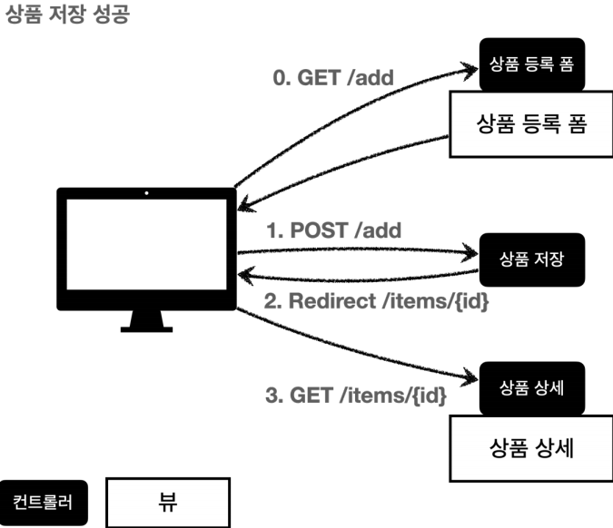
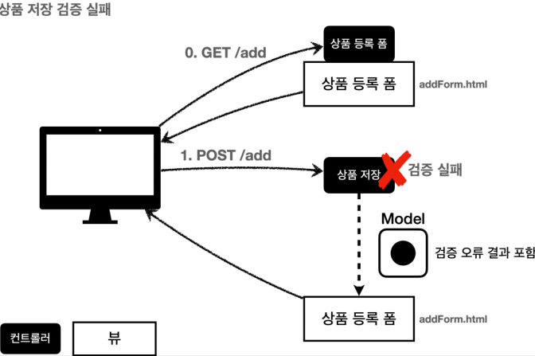

# 04. 검증1 - validation

# 목차

---

# 검증 요구사항

---

기존에 만들었던 상품 관리 시스템에 새 요구사항을 적용해보자.

- 타입 검증
    - 가격 및 수량에 문자가 들어가면 검증 오류 처리
- 필드 검증
    - 모든 입력 요소에는 공백을 허용하지 않는다.
    - 가격은 최소 1000원 최대 1백만 원
    - 최대 수량 9999
- 특정 필드의 범위를 넘어서는 검증
    - 가격 * 수량은 1만 원 이상

오류 처리는 비지니스 로직 개발과 맞먹을 정도로 중요하다. 사용자의 실수를 바로 잡아주는 편의성을 보장해줄 수 있는 것이 오류 처리이기 때문이다.

검증 방식은 크게 2가지로 나뉜다.

- 클라이언트 검증 : 빠르지만 공격에 취약함.
- 서버 검증 : 안정적이지만 즉시 반응할 수 없음.

이 두 특성을 타협해서 섞어 쓰는 것이 최적의 선택이다.

# 검증 직접 처리 - 소개

---

현재 우리가 개발해온 프로그램의 로직은 아래와 같다.



그러나 만약 상품 저장 과정에서 이상한 값들을 받아버린다면? 검증 오류 처리를 해야 할 것이다. 아래처럼 말이다.



위 로직을 요약하자면 다음과 같다.

- 상품 저장 도중 잘못된 값이 들어왔을 경우, model에 사용자가 작성했던 데이터를 다 담아서 다시 상품 저장 페이지로 되돌려준다. 이로써 사용자가 작성한 나머지 정보들이 손실되지 않도록 만들 수 있다.
- 이때 잘못된 부분은 보기 쉽게 따로 표시해준다.

# 검증 직접 처리 - 개발

---

초기 작업 환경은 강사님이 직접 꾸린 패키지 형식이라, 굳이 여기서 세팅하고 싶지 않다. 대신 핵심 코드들을 추출해서 유의미한 예제들만 남기도록 노력했다. 필요하면 섹션 2의 작업 환경을 참고하라.

## HTML에서 class의 역할

1. **스타일 적용**: 클래스를 사용하여 특정 요소에 스타일(CSS)을 적용할 수 있다. 클래스를 정의하고 해당 클래스에 대한 스타일을 CSS로 지정하면, 그 클래스가 적용된 요소는 지정된 스타일을 사용한다.

```html
<style>
    .highlight {
        background-color: yellow;
        font-weight: bold;
    }
</style>

<p class="highlight">이 텍스트는 강조 표시됩니다.</p>
```

위 예제는 “highlight” 클래스를 정의하고, 이 클래스를 갖는 'p' 요소에 'style'을 적용하는 코드이다. 

1. **식별자**: 클래스를 사용하여 특정 요소를 식별할 수 있다. CSS 스타일이나 자바스크립트에서 클래스를 사용하여 특정 요소에 접근하고 조작할 수 있다.

```html
<style>
    .special {
        color: red;
    }
</style>

<p id="uniqueId" class="special">이 텍스트는 특별한 색으로 표시됩니다.</p>

<script>
    var element = document.getElementById("uniqueId");
    element.textContent = "새로운 내용"; 
</script>
```

위 예제는 “special” 클래스를 갖는 'p' 요소를 “uniqueId”라는 ID값으로 식별하는 코드이다. `document.getElementById()` 를 사용하여 해당 ID를 갖는 요소에 접근하여 내용을 변경할 수 있다.

1. **그룹화**: 클래스를 사용하여 여러 요소를 그룹화할 수 있다. 동일한 클래스를 가지는 요소들은 함께 스타일이 적용되거나 자바스크립트로 조작되는 등의 일괄적인 작업이 가능하다.

```html
<style>
    .highlight {
        background-color: yellow;
        font-weight: bold;
    }
</style>

<p class="highlight">첫 번째 문장</p>
<p>두 번째 문장</p>
<p class="highlight">세 번째 문장</p>
```

위 예제는 “highlight” 클래스를 가진 'p' 요소들을 그룹화하여 스타일이 적용되는 코드이다. 

1. **재사용성**: 클래스를 정의하고 여러 요소에 적용하여 스타일과 동작을 재사용할 수 있다. 동일한 클래스를 가진 여러 요소가 동일한 스타일과 동작을 공유하게 된다.

```html
<style>
    .button {
        background-color: blue;
        color: white;
        padding: 10px 20px;
        border-radius: 5px;
    }
</style>

<button class="button">클릭</button>
<button class="button">확인</button>
```

위 예제는 “button” 클래스를 정의하고, 여러 'button' 요소들에 이 클래스를 적용하여 스타일을 재사용하는 코드이다.

## 상품 등록 검증

- ValidationControllerV1 수정

기존 코드는 검증 로직이 존재하지 않았다. 따라서 검증 로직을 추가한다.

```java
@PostMapping("/add")
    public String addItem(@ModelAttribute Item item, RedirectAttributes redirectAttributes, Model model) {
        Map<String, String> errors = new HashMap<>();  // 검증 오류 데이터를 임시로 저장하기 위한 로컬 변수

        // 요구 사항에 맞는 검증 로직 구현
        if(!StringUtils.hasText(item.getItemName())){  // SpringFramework의 StringUtils 사용
            errors.put("itemName", "상품 이름을 입력해주세요.");  // Map의 키값에는 item 객체에서 적절한 필드명으로 넣어준다.
        }

        if (item.getPrice() == null || item.getPrice() < 1000 || item.getPrice() > 1000000) {
            errors.put("price", "가격은 1,000 원에서 1,000,000 원 사이만 허용됩니다.");
        }

        if (item.getQuantity() == null || item.getQuantity() > 9999 || item.getQuantity() < 1){
            errors.put("quantity", "수량은 최소 1 개 최대 9,999 개 까지만 가능합니다.");
        }

				if (item.getPrice() != null && item.getQuantity() != null) {
            int val = item.getPrice() * item.getQuantity();
            if (val < 10000) {
                errors.put("globalError", "가격과 수량의 곱은 10,000 을 넘어야 합니다. 현재 값" + val);
            }
        }

        // 에러 발생 시 복귀 페이지
        if (!errors.isEmpty()){
            model.addAttribute("errors", errors);
            return "validation/v1/addForm";
        }

        // 검증 성공 시 진행 로직 - 리다이랙트
        Item savedItem = itemRepository.save(item);
        redirectAttributes.addAttribute("itemId", savedItem.getId());
        redirectAttributes.addAttribute("status", true);
        return "redirect:/validation/v1/items/{itemId}";
    }
```

테스트해보면 이전에 입력했던 값들이 그대로 유지되는 것을 볼 수 있다. `@ModelAttribute` 가 item 객체에 자동으로 담아두기 때문이다.

- addForm.html 수정

```html
...
<head>
    <meta charset="utf-8">
		<!-- 참고: Bootstrap에서는 "form-control"이라는 CSS 클래스를 제공한다. -->
    <link th:href="@{/css/bootstrap.min.css}" href="../css/bootstrap.min.css" rel="stylesheet">
    <style>
        .container {
            max-width: 560px;
        }
				<!-- 오류 메세지를 붉은 색으로 만들기 위한 css 코드 -->
        .field-error {
             border-color: #dc3545;
             color: #dc3545;
         }
    </style>
</head>
...

<form action="item.html" th:action th:object="${item}" method="post">
				<!-- 에러가 globalError인 경우에만 출력 -->
        <div th:if="${errors?.containsKey('globalError')}">
            <p class="field-error" th:text="${errors['globalError']}">전체 오류 메시지</p>
        </div>
				<div>
            <label for="itemName" th:text="#{label.item.itemName}">상품명</label>
            <input type="text" id="itemName" th:field="*{itemName}" th:class="${errors?.containsKey('itemName')} ? 'form-control field-error' : _"
                   class="form-control" placeholder="이름을 입력하세요">
            <div class="field-error" th:if="${errors?.containsKey('itemName')}"th:text="${errors['itemName']}">상품명 오류</div>
        </div>
        <div>
            <label for="price" th:text="#{label.item.price}">가격</label>
            <input type="text" id="price" th:field="*{price}" th:class="${errors?.containsKey('price')} ? 'form-control field-error' : _"
                   class="form-control" placeholder="가격을 입력하세요">
            <div class="field-error" th:if="${errors?.containsKey('price')}" th:text="${errors['price']}">가격 오류</div>
        </div>
        <div>
            <label for="quantity" th:text="#{label.item.quantity}">수량</label>
            <input type="text" id="quantity" th:field="*{quantity}" th:class="${errors?.containsKey('quantity')} ? 'form-control field-error' : _"
                   class="form-control" placeholder="수량을 입력하세요">
            <div class="field-error" th:if="${errors?.containsKey('quantity')}" th:text="${errors['quantity']}">수량 오류</div>
        </div>
			...
```

- 페이지 소스 보기

```html
<!-- 수량만 제대로 입력하지 않은 경우 -->
<form action="" method="post">
        
        <div>
            <label for="itemName">상품명</label>
            <input type="text" id="itemName" class="form-control" placeholder="이름을 입력하세요" name="itemName" value="ㅎㅇ">
            
        </div>
        <div>
            <label for="price">가격</label>
            <input type="text" id="price" class="form-control" placeholder="가격을 입력하세요" name="price" value="2000">
            
        </div>
        <div>
            <label for="quantity">수량</label>
            <input type="text" id="quantity" class="form-control field-error" placeholder="수량을 입력하세요" name="quantity" value="">
            <div class="field-error">수량은 최소 1 개 최대 9,999 개 까지만 가능합니다.</div>
        </div>
```

위 코드의 핵심 문법은 `th:if` 와 `?.`이다. 

- th:if  ← 조건이 참이면 해당 태그를 출력. 조건이 거짓이면 해당 태그를 출력하지 않음.
- ?.  ← 비교값이 null로 들어온 경우 NullPointerException이 아닌 null을 반환함. 최초 등록 시 errors라는 변수는 존재할 수가 없는데, 이 경우를 예외 처리한 것임. 이 문법은 SpringEL에서 제공한다.
- 삼항 연산자도 봐줄 만하다. `th:class` 에서 오류 검사할 때 ? 이후 전자는 조건식이 참인 경우 정의될 class값이고, 후자는 조건식이 거짓인 경우 정의될 class값이다. “_”는 아무것도 안 한다는 뜻을 가진다. 그래서 기존 class값을 그대로 가져간다.

하지만 위 코드는 상당히 불만족스럽다.

- 뷰 템플릿에 중복 코드가 많다.
- 현재 타입 오류 처리가 되지 않는다. model에 담을 수 없는 타입이면 비정상적인 행동을 한다.
- 잘못된 타입이 입력되더라도 정상적으로 템플릿을 호출해야 한다.
- 잘못된 타입이 입력되더라도 정상적으로 이전 값을 반환해야 한다.

# BindingResult1

---

Spring이 제공하는 `BindingResult` 인터페이스를 사용해서 검증 오류 처리를 해보자.

- ValidationItemControllerV2

팁 : Ctrl + P : 파라미터에 어떤 값을 넣어야 하는지 알려줌

```java
@PostMapping("/add")
    public String addItem(@ModelAttribute Item item, BindingResult bindingResult, RedirectAttributes redirectAttributes, Model model) {
        // 요구 사항에 맞는 검증 로직 구현
        if(!StringUtils.hasText(item.getItemName())){  // SpringFramework의 StringUtils 사용
            bindingResult.addError(new FieldError("item", "itemName", "상품 이름을 입력해주세요."));
        }

        if (item.getPrice() == null || item.getPrice() < 1000 || item.getPrice() > 1000000) {
            bindingResult.addError(new FieldError("item", "price", "가격은 1,000 원에서 1,000,000 원 사이만 허용됩니다."));
        }

        if (item.getQuantity() == null || item.getQuantity() > 9999 || item.getQuantity() < 1){
            bindingResult.addError(new FieldError("item", "quantity", "수량은 최소 1 개 최대 9,999 개 까지만 가능합니다."));
        }
        if (item.getPrice() != null && item.getQuantity() != null) {
            int val = item.getPrice() * item.getQuantity();
            if (val < 10000) {
                bindingResult.addError(new ObjectError("item", "가격과 수량의 곱은 10,000 을 넘어야 합니다. 현재 값" + val));
            }
        }

        // 에러 발생 시 복귀 페이지
        if (bindingResult.hasErrors()){
						// @Slf4j 어노테이션 추가할 것
						log.info("errors={}", bindingResult);
            // Spring에서 bindingResult로 뷰 템플릿에 데이터를 넘겨서 model 필요없음.
            return "validation/v2/addForm";
        }

        // 검증 성공 시 진행 로직 - 리다이랙트
        Item savedItem = itemRepository.save(item);
        redirectAttributes.addAttribute("itemId", savedItem.getId());
        redirectAttributes.addAttribute("status", true);
        return "redirect:/validation/v2/items/{itemId}";
    }
```

**반드시 addItem 메소드의 파라미터에 @ModelAttribute 다음에 BindingResult 를 넣도록 한다.**

- FieldError 생성자
    - 에러가 발생했으면 FieldError 객체를 생성하여 bindingResult에 담는다.
        - objectName : @ModelAttribute 가 적용된 객체의 이름
        - field : 오류가 발생한 객체의 필드 이름
        - defaultMessage : 오류가 발생했을 때 출력할 메세지
- ObjectError 생성자
    - 에러가 발생했는데 필드가 존재하지 않는 경우, ObjectError 객체를 생성하여 bindingResult에 담는다. 주로 글로벌 오류를 처리할 때 사용한다.

다음으로 뷰 템플릿도 수정해주자.

- addForm.html (v2 패키지)

```java
<form action="item.html" th:action th:object="${item}" method="post">
				<!-- 글로벌 오류 처리 -->
        <div th:if="${#fields.hasGlobalErrors()}">
            <p class="field-error" th:each="err : ${#fields.globalErrors()}" th:text="${err}">전체 오류 메시지</p>
        </div>
				<!-- 필드 오류 처리 -->
        <div>
            <label for="itemName" th:text="#{label.item.itemName}">상품명</label>
            <input type="text" id="itemName" th:field="*{itemName}" th:errorclass="field-error" class="form-control" placeholder="이름을 입력하세요">
            <div class="field-error" th:errors="*{itemName}">상품명 오류</div>
        </div>
        <div>
            <label for="price" th:text="#{label.item.price}">가격</label>
            <input type="text" id="price" th:field="*{price}" th:errorclass="field-error" class="form-control" placeholder="이름을 입력하세요">
            <div class="field-error" th:errors="*{price}">상품명 오류</div>
        </div>
        <div>
            <label for="quantity" th:text="#{label.item.quantity}">수량</label>
            <input type="text" id="quantity" th:field="*{quantity}" th:errorclass="field-error" class="form-control" placeholder="이름을 입력하세요">
            <div class="field-error" th:errors="*{quantity}">상품명 오류</div>
        </div>
```

thymeleaf에서는 Spring의 `BindingResult`를 통해 편리하게 검증 오류를 표현할 수 있는 기능을 제공한다.

- `#fields`  ← BindingResult가 제공하는 검증 오류에 접근할 수 있다.
- `th:errors`  ← 해당 필드에 오류가 있는 경우에만 해당 태그를 렌더링한다.
- `th:errorclass`  ← th:field에서 지정한 필드에 오류가 있으면 기존 class에 지정한 클래스를 추가한다.

# BindingResult2

---

- `BindingResult` 는 검증 오류를 저장할 수 있는 객체이다. 만약 검증 오류를 저장해야 한다면 BindiingResult를 활용하면 된다.
- 그리고 BindingResult를 사용하면 `@ModelAttribute`에 데이터 바인딩 도중 오류가 발생해도 컨트롤러가 호출되어, Spring 기본 에러 페이지를 띄울 일이 없어진다!
- BindingResult는 인터페이스이다. 그리고 Errors 인터페이스를 상속받고 있다. Errors 인터페이스는 단순한 오류 저장 및 조회 기능을 제공하는데, BindingResult는 여기에 더해 부가적인 기능을 갖고 있다고 보면 된다.

## BindingResult에 검증 오류를 적용하는 3가지 방법

1. @ModelAttribute의 객체가 타입 오류 등으로 바인딩이 실패하는 경우, Spring이 자동으로 FieldError를 생성하여 BindingResult에 넣어준다.
2. 개발자가 직접 BindingResult에 넣어준다.
3. Validator를 사용한다. (추후에 자세히 설명)

숫자만 입력되어야 할 곳에 문자를 입력해서 타입 오류를 일으킨 후에, bindingResult 객체에 저장된 값을 살펴보자. 

## BindingResult 사용 시 주의점

- BindingResult 객체는 파라미터 위치가 중요하다. 검증할 객체의 바로 다음 위치에 BindingResult를 받아야 해당 객체를 대상으로 동작한다.
- BindingResult는 model에 자동으로 포함되므로, model.addAttribute해서 bindingResult를 model에 담으려고 하지 않아도 된다.

# FieldError, ObjectError

---

이번에는 에러가 발생했을 때 사용자의 입력을 유지한 채로 에러를 표시하도록 만들어보자. 지금은 타입 에러가 발생했을 때 오류가 아닌, 단순히 입력 숫자가 조건에 맞지 않았을 때의 검증 오류만 다룰 것이다. 이는 사용자의 편의성을 제공해주기 위해 반드시 고려해야 할 옵션이다. 이전에 addItem 메소드의 @PostMapping 어노테이션을 주석처리하여 테스트를 진행하자.

```java
@PostMapping("/add")
    public String addItemV2(@ModelAttribute Item item, BindingResult bindingResult,
                            RedirectAttributes redirectAttributes) {
        if (!StringUtils.hasText(item.getItemName())) {
            bindingResult.addError(new FieldError("item", "itemName",
                    item.getItemName(), false, null, null, "상품 이름은 필수입니다."));
        }
        if (item.getPrice() == null || item.getPrice() < 1000 || item.getPrice() >
                1000000) {
            bindingResult.addError(new FieldError("item", "price", item.getPrice(),
                    false, null, null, "가격은 1,000 ~ 1,000,000 까지 허용합니다."));
        }
        if (item.getQuantity() == null || item.getQuantity() > 10000) {
            bindingResult.addError(new FieldError("item", "quantity",
                    item.getQuantity(), false, null, null, "수량은 최대 9,999 까지 허용합니다."));
        }
        //특정 필드 예외가 아닌 전체 예외
        if (item.getPrice() != null && item.getQuantity() != null) {
            int resultPrice = item.getPrice() * item.getQuantity();
            if (resultPrice < 10000) {
                bindingResult.addError(new ObjectError("item", null, null, "가격 * 수량의 합은 10,000원 이상이어야 합니다. 현재 값 = " + resultPrice));
            }
        }
        if (bindingResult.hasErrors()) {
            log.info("errors={}", bindingResult);
            return "validation/v2/addForm";
        }
        //성공 로직
        Item savedItem = itemRepository.save(item);
        redirectAttributes.addAttribute("itemId", savedItem.getId());
        redirectAttributes.addAttribute("status", true);
        return "redirect:/validation/v2/items/{itemId}";
    }
```

이제 서버를 재실행하면, 사용자 입력 값이 그대로 남아있는 모습을 볼 수 있다.

## FieldError 생성

`FieldError`는 두 가지 생성자를 제공한다.

1. 위에서 언급했던 FieldError 생성자

```java
public FieldError(String objectName, String field, String defaultMessage);
```

1. 에러 발생 시 이전에 입력한 값을 임시저장할 수 있는 보완된 FieldError 생성자

```java
public FieldError(String objectName, String field, String defaultMessage);
public FieldError(String objectName, String field, @Nullable Object 
rejectedValue, boolean bindingFailure, @Nullable String[] codes, @Nullable
Object[] arguments, @Nullable String defaultMessage)
```

각 파라미터의 용도를 살펴보자.

- objectName: 오류가 발생한 객체의 이름
- field: 오류가 발생한 필드
- rejectedValue: 오류가 발생했을 때 사용자가 입력한 값
- bindingFailure: 해당 오류가 타입 오류 같은 바인딩 실패 오류인지, 아니면 검증 실패 오류인지 구분하는 값
- codes: 오류 메세지 코드
- arguments: 오류 메세지에서 사용하는 인자
- defaultMessage: 기본으로 제공할 오류 메세지

참고로 `ObjectError`도 FieldError와 비슷한 두 개의 생성자가 있는데, FieldError와는 달리 필드 파라미터가 없는 형태이다.

## 오류 발생 시 사용자 입력 값 유지

사용자 입력 데이터가 컨트롤러의 @ModelAttribute 어노테이션에 바인딩되는 시점에 오류가 발생하면 model 객체에 사용자 입력 값을 유지하기 어렵다. 예컨데, 가격은 Integer로 받기로 했는데 입력된 값이 String이면, 타입 오류로 인해 이 에러 값을 해당 가격 필드에 저장할 수 없다. 그래서 이 오류값을 일종의 temp를 사용해서 받아 둘 방법이 필요하다.

FieldError가 이 기능을 제공하는 것이다. 

- rejectedValue가 오류 발생 시 사용자 입력 값을 저장하는 필드이다.
- bindingFailure는 타입 오류 같은 바인딩 실패로 인한 오류인지 여부를 적어주면 된다. 지금 우리는 숫자값이 조건을 만족하지 않았을 때 검증 오류를 처리하고 있으므로, 타입 오류 에러는 아니기 때문에 false를 입력한다.

## Thymeleaf의 사용자 입력 값 유지

```html
th:field = "*{price}"
```

thymeleaf의 th:field는 정상적인 상황에서는 모델 객체의 값을 사용하지만, 오류가 발생한 상황에서는 FieldError에서 보관한 값을 사용해서 출력한다.

## Spring의 바인딩 오류 처리

만약 타입 오류로 인해 바인딩에 실패하면, Spring은 일단 FieldError를 호출하여 사용자가 입력한 값을 넣어둔다. 그리고 해당 오류를 BindingResult에 담아서 컨트롤러를 호출한다. 그래서 타입 오류와 같은 바인딩 실패 시에도 사용자의 오류 입력값을 유지할 수 있는 것이다.

# 오류 코드와 메세지 처리1 (오류 메세지 설정)

---

## error 메세지 파일 생성

기존에 만들어둔 messages.properties 파일을 활용해도 되지만, 오류 메세지를 따로 구분하기 위해 errors.properties 파일을 생성하자. (경로는 resources 패키지 바로 아래)

우선 application.properties 파일에 아래 코드를 추가한다. 이렇게 하면 messages.properties와 errors.properties 파일을 모두 인식할 수 있다. (아무것도 추가하지 않은 default는 messages.properties만 인식함.)

```html
spring.messages.basename=messages,errors
```

그리고 errors.properties 파일에는 아래 코드를 추가한다.

```html
required.item.itemName=상품 이름은 필수입니다.
range.item.price=가격은 {0} ~ {1} 까지 허용합니다.
max.item.quantity=수량은 최대 {0} 까지 허용합니다.
totalPriceMin=가격 * 수량의 합은 {0}원 이상이어야 합니다. 현재 값 = {1}
```

참고로 errors_en.properties 파일을 생성하면 오류 메세지도 국제화 처리가 가능하다.

**주의: 만약 한글이 깨지는 경우, Intellj에서 “파일 - 설정 - 에디터- 코드 스타일 - 파일 인코딩” 에 들어가서 .properties 파일 항목의 디폴트 인코딩을 UTF-8로 바꿔주자.**

이제 위 파일을 사용하기 위해 기존 메소드를 바꿔주자. 진행하기 앞서, addItemV2의 @PostMapping 어노테이션을 주석 처리 해두자.

```java
@PostMapping("/add")
public String addItemV3(@ModelAttribute Item item, BindingResult bindingResult,
RedirectAttributes redirectAttributes) {
 if (!StringUtils.hasText(item.getItemName())) {
 bindingResult.addError(new FieldError("item", "itemName", item.getItemName(), false, new String[]{"required.item.itemName"}, null, null));
 }
 if (item.getPrice() == null || item.getPrice() < 1000 || item.getPrice() > 1000000) {
 bindingResult.addError(new FieldError("item", "price", item.getPrice(), false, new String[]{"range.item.price"}, new Object[]{1000, 1000000}, null));
 }
 if (item.getQuantity() == null || item.getQuantity() > 10000) {
 bindingResult.addError(new FieldError("item", "quantity", item.getQuantity(), false, new String[]{"max.item.quantity"}, new Object[]
{9999}, null));
 }
 //특정 필드 예외가 아닌 전체 예외
 if (item.getPrice() != null && item.getQuantity() != null) {
 int resultPrice = item.getPrice() * item.getQuantity();
 if (resultPrice < 10000) {
 bindingResult.addError(new ObjectError("item", new String[]{"totalPriceMin"}, new Object[]{10000, resultPrice}, null));
 }
 }
 if (bindingResult.hasErrors()) {
 log.info("errors={}", bindingResult);
 return "validation/v2/addForm";
 }
 //성공 로직
 Item savedItem = itemRepository.save(item);
 redirectAttributes.addAttribute("itemId", savedItem.getId());
 redirectAttributes.addAttribute("status", true);
 return "redirect:/validation/v2/items/{itemId}";
}
```

위 코드의 변경점을 아래와 같다.

- codes: 오류 메세지 코드를 null → errors.properties에 정의한 프로퍼티 키 이름으로 변경해줬다. 이렇게 하면 해당 프로퍼티 키의 값이 딸려온다. 그리고 codes 배열 안에 여러 개의 프로퍼티 키들을 넣을 수 있는데, 그러면 앞에서부터 순차적으로 존재하는 프로퍼티 키가 있는지 확인하고, 가장 먼저 확인된 프로퍼티 키의 값을 가져온다.(이게 추후 개발 컨셉에 정말 중요한 역할을 함.)
- arguments: 가져온 프로퍼티 값에 들어갈 변수들을 순차적으로 넣어준다.
- defaultMessage: 이제 필요없으므로 null처리.

서버를 재실행해보면 정상적으로 작동하는 것을 볼 수 있다.

# 오류 코드와 메세지 처리2 (rejectValue 메소드)

---

하지만 `FieldError` 생성자는 너무 많은 파라미터를 요구한다. 그래서 이 방식으로 에러 메세지를 처리하는 것은 권장하지 않는다.

컨트롤러에서 `BindingResult`는 검증 객체인 `target` 바로 뒤에 오도록 파라미터에서 정의했다. 이렇게 하면 BindingResult는 자신이 검증해야 할 target 객체를 미리 알게 된다. 

```java
// @ModelAttribute Item item 바로 뒤에 BindingResult를 인자로 받은 상태.
log.info("objectName={}", bindingResult.getObjectName());
log.info("target={}", bindingResult.getTarget());
```

```java
// 실행결과
objectName=item //@ModelAttribute name
target=Item(id=null, itemName=상품, price=100, quantity=1234)
```

## rejectValue(), reject() 메소드

rejectValue(), reject() 는 BindingResult에서 제공하는 메소드이다. 이 메소드를 쓰면 FieldError, ObjectError 객체 생성없이 깔끔하게 검증 오류를 다룰 수 있다.

1. rejectValue()는 메소드 오버로딩으로 세 개의 메소드를 가지며, 아래의 파라미터들을 받는다.

```java
void rejectValue(@Nullable String field, String errorCode);
void rejectValue(@Nullable String field, String errorCode,
	@Nullable String defaultMessage);
void rejectValue(@Nullable String field, String errorCode,
	@Nullable Object[] errorArgs, @Nullable String defaultMessage);
```

- field: 오류 필드 명
- errorCode: 오류 코드 (messageResolver를 위한 오류 코드, 추후 설명하겠음)
- errorArgs: 오류 메세지에서 파라미터들을 치환하기 위한 값
- defaultMessage: 오류 메세지가 정의되지 않았을 때 사용할 기본 오류 메세지
1. reject()는 rejectValue() 메소드에서 field 파라미터가 제거된 형태이다.

```java
void reject(String errorCode);
void reject(String errorCode, @Nullable String defaultMessage);
void reject(String errorCode, @Nullable Object[] errorArgs, @Nullable String 
defaultMessage);
```

## 예제 코드

addItemV3의 @PostMapping을 주석처리하고 아래 메소드를 추가한다.

```java
@PostMapping("/add")
    public String addItemV4(@ModelAttribute Item item, BindingResult bindingResult, RedirectAttributes redirectAttributes) {
        log.info("objectName={}", bindingResult.getObjectName());
        log.info("target={}", bindingResult.getTarget());
        if (!StringUtils.hasText(item.getItemName())) {
            bindingResult.rejectValue("itemName", "required");
        }
        if (item.getPrice() == null || item.getPrice() < 1000 || item.getPrice() > 1000000) {
            bindingResult.rejectValue("price", "range", new Object[]{1000, 1000000}, null);
        }
        if (item.getQuantity() == null || item.getQuantity() > 10000) {
            bindingResult.rejectValue("quantity", "max", new Object[]{9999}, null);
        }
        //특정 필드 예외가 아닌 전체 예외
        if (item.getPrice() != null && item.getQuantity() != null) {
            int resultPrice = item.getPrice() * item.getQuantity();
            if (resultPrice < 10000) {
                bindingResult.reject("totalPriceMin", new Object[]{10000, resultPrice}, null);
            }
        }
        if (bindingResult.hasErrors()) {
            log.info("errors={}", bindingResult);
            return "validation/v2/addForm";
        } //성공 로직
        Item savedItem = itemRepository.save(item);
        redirectAttributes.addAttribute("itemId", savedItem.getId());
        redirectAttributes.addAttribute("status", true);
        return "redirect:/validation/v2/items/{itemId}";
    }
```

이전 코드에서 변경된 점은 아래와 같다.

- bindingResult.addError()에서 bindingResult.rejectValue() 메소드로 변경했다.
- ObjectError 객체를 사용하는 부분은 따로 bindingResult.addError()에서 bindingResult.rejectValue() 메소드로 변경했다.

## 축약된 오류 코드

- BindingResult는 이미 target 객체를 알고 있다. 그래서 target(item)에 대한 정보는 입력받지 않아도 된다.
- FieldError 객체를 직접 다룰 때에는 codes 파라미터에  “range.item.price”와 같이 오류 코드를 직접 입력해줬어야 했다. 그러나 rejectValue() 메소드를 사용하면서 오류 코드를 “range”와 같이 간단하게 입력했다. 이 부분은 `MessageCodesResolver` 에서 자동으로 처리해주는 건데, 이에 대해서는 추후에 알아보도록 하자.

# 오류 코드와 메세지 처리3 (단순함 vs 세밀함)

---

이전에 우리는 오류 코드를 아래와 같이 작성했다.

```java
required.item.itemName=상품 이름은 필수입니다.
range.item.price=가격은 {0} ~ {1} 까지 허용합니다.
max.item.quantity=수량은 최대 {0} 까지 허용합니다.
```

근데, 더 단순하게 작성하면 더 범용적으로 코드를 재사용할 수 있는 거 아니야?

```java
required= 필수 입력 값입니다.
range= 입력값은{0} ~ {1} 까지 허용합니다.
max=입력값은 최대 {0} 까지 허용합니다.
```

그렇다. 단순하면 범용성이 높아지고, 세밀하면 내용의 구체성이 높아진다. 그러나 개발자는 개발 편의성을 위해 단순하게 작성할 줄 알아야 하며, 구체적인 요구사항을 만족시키기 위해 세밀하게 작성할 줄도 알아야 한다.

그렇게 하기 위해서는 아래와 같이 에러 메세지의 우선순위를 나눠서 작성해두면 될 것이다. 구체적인 정보일수록 높은 우선순위, 단순한 정보일수록 낮은 우선순위를 갖도록 하면, 세밀함이 필요할 때와 단순함이 필요할 때 모두 만족시킬 수 있게 된다.

```
#Level1
required.item.itemName: 상품 이름은 필수 입니다.
#Level2
required: 필수 값 입니다.
```

앞에서 codes 는 String 배열로, 순차적으로 오류 메세지를 검색해서 조회한다고 했다. 그러니까 아래처럼 함수를 작성해주면 단순함과 세밀함을 모두 가지는 코드를 작성할 수 있게 된다.

```java
 bindingResult.addError(new FieldError("item", "itemName", item.getItemName(), false, 
	new String[]{"required.item.itemName", "required"}, null, null));
```

# 오류 코드와 메세지 처리4 (MessageCodesResolver)

---

## MessageCodesResolver

앞에서 codes에 String 배열로 여러 개의 에러 메세지들을 입력해서 유연하게 동작할 수 있도록 코드를 작성하는 방법을 알아보았다. 하지만 rejectValue() 메소드를 사용할 때, 우리는 일일이 에러 메시지들을 입력해 넣을 필요가 없다. 그냥 errorCode만 딸깍 입력하면 끝이다.

그 이유는, rejectValue()와 reject() 메소드가 자체적으로 `MessageCodesResolver` 인터페이스를 사용하기 때문이다. 아래 테스트 코드를 살펴보자.

```java
package hello.itemservice.validation;
import org.junit.jupiter.api.Test;
import org.springframework.validation.DefaultMessageCodesResolver;
import org.springframework.validation.MessageCodesResolver;
import static org.assertj.core.api.Assertions.assertThat;

public class MessageCodesResolverTest {
	 MessageCodesResolver codesResolver = new DefaultMessageCodesResolver();
	 @Test
	 void messageCodesResolverObject() {
			String[] messageCodes = codesResolver.resolveMessageCodes("required","item"); 
			assertThat(messageCodes).containsExactly("required.item", "required");
	 }

	 @Test
	 void messageCodesResolverField() {
			 String[] messageCodes = codesResolver.resolveMessageCodes("required", "item", "itemName", String.class);
			 assertThat(messageCodes).containsExactly(
			 "required.item.itemName",
			 "required.itemName",
			 "required.java.lang.String",
			 "required"
			 );
	 }
}
```

위 코드는 DefaultMessageCodesResolver를 구현체로 받는 codesResolver의 `resolveMessageCodes()` 메소드가 핵심이다.  이 메소드는 두 개의 메소드로 오버로딩되어 있다. 

아래는 MessageCodesResolver에 정의되어 있는 resolveMessageCodes의 추상 메소드이다.

```java
String[] resolveMessageCodes(String errorCode, String objectName);
String[] resolveMessageCodes(String errorCode, String objectName, String field, 
	@Nullable Class<?> fieldType);
```

근데 무엇을 기준으로 문자열이 생성되는 것일까?

## DefaultMessageCodesResolver의 기본 메세지 생성 규칙

### 1. 객체 오류

객체 오류는 아래의 방식으로 메세지가 생성된다.

1. code + "." + object name
2. code

예시) 오류 코드: required, object name: item

1. required.item
2. required

### 2. 필드 오류

필드 오류의 경우 다음 순서로 4가지 메시지 코드가 생성된다.

1. code + "." + object name + "." + field
2. code + "." + field
3. code + "." + field type
4. code

예시) 오류 코드: typeMismatch, object name "user", field "age", field type: int

1. "typeMismatch.user.age"
2. "typeMismatch.age"
3. "typeMismatch.int"
4. "typeMismatch"

그래서 만약 아래처럼 메소드를 호출했다면…

```java
String[] messageCodes = codesResolver.resolveMessageCodes("required", "item", "itemName", String.class);
```

messageCodes는 아래의 값들을 저장하게 된다.

```java
{
"required.item.itemName",
"required.itemName",
"required.java.lang.String",
"required"
}
```

## rejectValue(), reject() 메소드에서의 활용

만약 아래 코드처럼 rejectValue() 메소드가 작성되어 있다면, 이 메소드는 필드 오류를 처리하므로 총 4개의 에러 메세지가 생성되었을 것이다.

```java
// void rejectValue(@Nullable String field, String errorCode);
bindingResult.rejectValue("itemName", "required");
```

bindingResult.addError() 메소드에서의 String 배열인 codes 파라미터를 떠올려보자. 위 메소드를 통해, codes 문자열 배열에는 순차적으로 아래 문자열들이 저장되어 있을 것이다.

```java
{
"required.item.itemName",
"required.itemName",
"required.java.lang.String",
"required"
}
```

알다시피 rejectValue는 objectName 파라미터를 받지 않는다. bindingResult는 자신의 target이 “item”임을 알고 있기 때문에, objectName을 입력받을 필요가 없기 때문이다.

이번에는 reject() 메소드의 예시를 보자.

```java
// void reject(String errorCode);
bindingResult.reject("totalPriceMin");
```

그러면 위의 생성 규칙으로 인해 codes에는 아래 문자열 배열이 저장되어 있을 것이다.

```java
{
"totalPriceMin.item",
"totalPriceMin"
}
```

## 오류 메세지 출력

thymeleaf 화면을 렌더링할 때 th:error도 실행되는데, 만약 오류가 확인이 된다면 생성된 오류 메세지 코드를 순서대로 찾아간다. 아무것도 찾지 못했으면 디폴트 메세지를 출력한다.

# 오류 코드와 메세지 처리5 (오류 코드 관리)

---

## 오류 코드 관리 전략

앞서 소개했듯, 오류 코드 관리는 구체적인 것부터 시작하고 단순한 것으로 끝맺음으로 하는 것이 좋다. 

errors.properties 파일을 아래처럼 수정해주자.

```
#required.item.itemName=상품 이름은 필수입니다.
#range.item.price=가격은 {0} ~ {1} 까지 허용합니다.
#max.item.quantity=수량은 최대 {0} 까지 허용합니다.
#totalPriceMin=가격 * 수량의 합은 {0}원 이상이어야 합니다. 현재 값 = {1}

#==ObjectError==
#Level1
totalPriceMin.item=상품의 가격 * 수량의 합은 {0}원 이상이어야 합니다. 현재 값 = {1}

#Level2 - 생략
totalPriceMin=전체 가격은 {0}원 이상이어야 합니다. 현재 값 = {1}

#==FieldError==
#Level1
required.item.itemName=상품 이름은 필수입니다.
range.item.price=가격은 {0} ~ {1} 까지 허용합니다.
max.item.quantity=수량은 최대 {0} 까지 허용합니다.
#Level2 - 생략

#Level3
required.java.lang.String = 필수 문자입니다.
required.java.lang.Integer = 필수 숫자입니다.
min.java.lang.String = {0} 이상의 문자를 입력해주세요.
min.java.lang.Integer = {0} 이상의 숫자를 입력해주세요.
range.java.lang.String = {0} ~ {1} 까지의 문자를 입력해주세요.
range.java.lang.Integer = {0} ~ {1} 까지의 숫자를 입력해주세요.
max.java.lang.String = {0} 까지의 문자를 허용합니다.
max.java.lang.Integer = {0} 까지의 숫자를 허용합니다.

#Level4
required = 필수 값 입니다.
min= {0} 이상이어야 합니다.
range= {0} ~ {1} 범위를 허용합니다.
max= {0} 까지 허용합니다.
```

자세한 설명은 앞에서 했으니 참고 바람.

## ValidationUtils

ValidationUtils 클래스를 사용하면 StringUtils를 사용한 에러 처리를 더 단순하게 처리할 수 있다.

```java
// 수정 전
if (!StringUtils.hasText(item.getItemName())) {
            bindingResult.rejectValue("itemName", "required");
}
```

```java
// 수정 후
ValidationUtils.rejectIfEmptyOrWhitespace(bindingResult, "itemName", "required");
```

# 오류 코드와 메세지 처리6 (타입 오류 처리)

---

검증 오류 방식은 아래처럼 두 가지로 나뉜다.

1. 개발자가 직접 추가 → rejectValue() 메소드 활용
2. Spring에서 자동으로 추가 (대부분의 타입 에러에 대해)

## 타입 오류 처리

이전까지는 단순히 검증 오류에 대해서 알아보았다. 이번에는 타입 오류를 처리해보도록 하자.

숫자만 입력해야 하는 칸에 문자를 입력하면, 우리가 넣어주지도 않았던 에러 처리가 자동으로 되어 있는 것을 확인할 수 있다. 로그를 보자.

```
codes [typeMismatch.item.price,typeMismatch.price,typeMismatch.java.lang.Integer,typeMismatch];
```

우리는 errors.properties 파일에 typeMismatch 항목을 추가한 적이 없다. Spring에서 자동으로 추가해준 것이다.

하지만 Spring이 자동으로 추가해준 에러 메세지는 너무 개발자 친화적이다. 유저에게 맞추기 위해서는 메세지를 직접 수정할 필요가 있다. 다행히 Spring 내부 파일을 뒤져서 하는 방식이 아닌, errors.properties 파일에 typeMismatch 항목을 추가해줌으로써 오버라이드할 수 있다.

```
#추가
typeMismatch.java.lang.Integer=숫자를 입력해주세요.
typeMismatch=타입 오류입니다.
```

위 내용을 errors.properties 파일에 추가하고 서버를 재실행해보자. 지저분한 에러 메세지가 위 메세지로 변경되었음을 확인할 수 있다.

# Validatior 분리 1

---

근데 지금 보면 컨트롤러가 검증 로직에 의해서 가독성이 매우 떨어져 버렸다. 따로 검증 로직을 분리해야 할 필요성이 느껴진다.

컨트롤러와 같은 패키지에 아래 클래스를 만들어주자. 이 클래스가 기존 컨트롤러의 검증 로직을 대부분 다 가져갈 것이다. 이 클래스를 Bean에 등록해서 사용한다. 

```java
package hello.itemservice.web.validation;

import hello.itemservice.domain.item.Item;
import org.springframework.stereotype.Component;
import org.springframework.validation.Errors;
import org.springframework.validation.ValidationUtils;
import org.springframework.validation.Validator;

@Component
public class ItemValidation implements Validator {

    @Override
    public boolean supports(Class<?> clazz) {
        return Item.class.isAssignableFrom(clazz);
    }

    @Override
    public void validate(Object target, Errors errors) {
        Item item = (Item) target;

        ValidationUtils.rejectIfEmptyOrWhitespace(errors, "itemName", "required");

        if (item.getPrice() == null || item.getPrice() < 1000 || item.getPrice() > 1000000) {
            errors.rejectValue("price", "range", new Object[]{1000, 1000000}, null);
        }

        if (item.getQuantity() == null || item.getQuantity() > 10000) {
            errors.rejectValue("quantity", "max", new Object[]{9999}, null);
        }

        //특정 필드 예외가 아닌 전체 예외
        if (item.getPrice() != null && item.getQuantity() != null) {
            int resultPrice = item.getPrice() * item.getQuantity();
            if (resultPrice < 10000) {
                errors.reject("totalPriceMin", new Object[]{10000, resultPrice}, null);
            }
        }
    }
}
```

이 클래스는 Validator 라는 인터페이스를 구현한다.

```java
public interface Validator {
	boolean supports(Class<?> clazz);
	void validate(Object target, Errors errors);
}
```

- supports (추후에 알아보자)
- validate(Object target, Errors errors): 기존 검증 로직이 들어갈 추상 메소드이다.

사실 지금 당장은 Validator 인터페이스를 구현할 필요는 없다. 그냥 일반적인 클래스처럼 호출해도 잘 작동한다. 하지만 인터페이스 구현을 통해 Spring에서 도와주는 기능들이 있는데, 이에 대해서는 추후에 알아보도록 하자.

그리고 기존 컨트롤러의 메소드도 수정해주자. 앞쪽에 방금 Bean에 등록한 클래스를 받아온다. 필드 선언만 **private final**로 해주면 Lombok의 `@RequiredArgsConstructor` 에 의해 컨테이너에서 자동으로 딸려온다.

```java
private final ItemValidation itemValidator;
```

```java
@PostMapping("/add")
    public String addItemV5(@ModelAttribute Item item, BindingResult bindingResult, RedirectAttributes redirectAttributes) {
        itemValidator.validate(item, bindingResult);

        if (bindingResult.hasErrors()) {
            log.info("errors={}", bindingResult);
            return "validation/v2/addForm";
        }

        //성공 로직
        Item savedItem = itemRepository.save(item);
        redirectAttributes.addAttribute("itemId", savedItem.getId());
        redirectAttributes.addAttribute("status", true);
        return "redirect:/validation/v2/items/{itemId}";
    }
```

그리고 메소드 안에서는 앞서 만든 클래스의 validate 메소드를 호출하여 이전에 만들어둔 검증 로직을 거치도록 만든다. 이렇게 하면 기존 로직은 전혀 변경되지 않으면서, 컨트롤러 클래스의 전체적인 가독성이 향상된다는 장점이 있다.

# Validatior 분리 2

---

이번에는 좀 더 검증 로직을 간소화시켜보자.

## WebDataBinder

`WebDataBinder` 는 Spring의 파라미터 바인딩의 역할을 해주며, 검증 기능도 내부에 포함하여 컨트롤러에 자동으로 적용시킨다.

기존에 쓰던 컨트롤러의 앞 부분에 아래 메소드를 추가해주자.

```java
@InitBinder
public void init(WebDataBinder dataBinder) {
	log.info("init binder {}", dataBinder); 
	dataBinder.addValidators(itemValidator);
}
```

dataBinder에 검증기를 추가해주면, 해당 컨트롤러에는 검증기를 자동으로 적용할 수 있다.

- @InitBinder : 해당 컨트롤러에만 영향을 주도록 제한함.

## @Validated

기존 컨트롤러에서 쓰던 메소드를 이 메소드로 교체해준다.

```java
@PostMapping("/add")
public String addItemV6(@Validated @ModelAttribute Item item, BindingResult bindingResult, 
												RedirectAttributes redirectAttributes) {

    if (bindingResult.hasErrors()) {
				log.info("errors={}", bindingResult);
        return "validation/v2/addForm";
    }

    //성공 로직
    Item savedItem = itemRepository.save(item);
    redirectAttributes.addAttribute("itemId", savedItem.getId());
    redirectAttributes.addAttribute("status", true);
    return "redirect:/validation/v2/items/{itemId}";
}
```

기존 코드에서의 변경점

- validator 를 직접 호출하는 부분이 사라졌다.
- 그 대신 검증 대상 객체 앞에 @Validated 어노테이션을 추가했다. (파라미터 부분)

`@Validated` 어노테이션은 검증기를 실행하라는 명령을 담고 있다. 이 어노테이션이 붙으면 앞에서 `WebDataBinder`에 등록한 검증기를 찾아서 실행한다. 만약 검증기가 여러 개인 경우, 각 검증기 안의 supports() 메서드를 통해 호환되는 검증기를 찾는다. (객체 클래스가 일치하는 것을 찾는 거임)

글로벌적으로 설정하여 모든 컨트롤러에 다 적용할 수는 있는데, 이건 개발자에게 역효과를 일으키므로 하지 않는다.